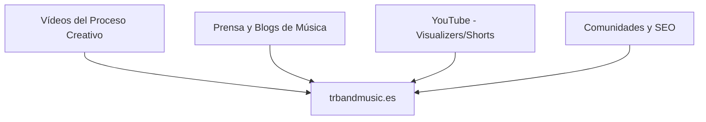

# 🎯 Frentes Estratégicos: trbandmusic.es (Visibilidad y Monetización)

Para maximizar el impacto de **The Research Band**, dividimos todas nuestras acciones en dos frentes claros y de alta prioridad: **Hacer ruido (Tráfico al dominio)** y **Hacer caja (Monetización directa)**.

---

## 🌐 FRENTE 1: Promoción Masiva de trbandmusic.es (Tráfico y Marca)
El objetivo es que el dominio se convierta en el centro de tu universo musical y reciba visitas de melómanos y profesionales.

### 1. Tracción Orgánica en Redes (Atracción Visual)
* **El proceso creativo "In-the-Box" (100% digital):** Mostrar cómo compones y arreglas tus temas desde el ordenador. Vídeos cortos de 10-15 segundos grabando la pantalla con el secuenciador en acción (el piano roll, las ondas de las pistas de voz y los instrumentos virtuales) combinados con tus manos y tu cerebro construyendo el tema.
* **Llamada a la Acción (CTA) única:** En todas las publicaciones, el destino final es invitarles a escuchar la experiencia completa en `trbandmusic.es`.

### 2. Relaciones Públicas Digitales (PR)
* **Blogs e Hilos de Comunidad:** Compartir la web en comunidades y foros de amantes de la producción musical digital, el Jazz-Rock y el Funk Fusion.
* **Podcasts y Radios Online:** Colaborar con programas de radio independientes especializados en música instrumental y de autor.

### 3. SEO (Posicionamiento en Buscadores)
* Optimizar la web para que aparezca al buscar: *Spanish Jazz-Rock, 80s Synth Fusion, Instrumental Music Spain*.

---

## 💰 FRENTE 2: El Retorno Económico (Monetización Directa)
Detalle de las vías de ingresos monetarios para rentabilizar tu catálogo de autor.

### 🎥 Canal A: Sincronización (Sync Licensing) — *El Mayor Margen*
* **¿Qué es?:** Licenciar tus canciones para series, películas, documentales, videojuegos o publicidad.
* **El Plan Monetario:**
  * Al ser **100% One-Stop** (tú posees el 100% del Master y de la Editorial/Publishing), el cobro de la licencia te llega íntegro a ti, sin intermediarios que se lleven comisiones.
  * Los supervisores musicales compran rápido cuando el proceso de derechos es sencillo y directo.

### 📻 Canal B: Derechos de Autor (SGAE / Liquidaciones) — *Ingreso Pasivo*
* **¿Qué es?:** Los cobros semestrales por los derechos de reproducción y comunicación pública de tus temas.
* **El Plan Monetario:**
  * Tener al día los registros (como los 15 temas que acabamos de archivar en la carpeta de la SGAE) para asegurar que cada vez que suenen en radio, televisión o plataformas acumules tus regalías.

### 🎧 Canal C: Streaming y Venta Directa (Bandcamp / Descargas)
* **Venta Directa:** Ofrecer la descarga de archivos de audio en alta resolución (WAV/FLAC) a coleccionistas y melómanos exigentes en la web.
