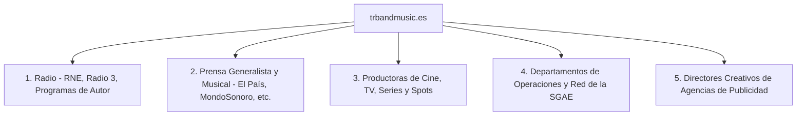

# 📣 Plan de Difusión Masiva: trbandmusic.es

El objetivo único de este plan es conseguir la **máxima exposición del dominio `trbandmusic.es`**, apoyándonos en tu impecable y prestigioso bagaje profesional en la historia de la música y la publicidad de España. 

Aquí tu trayectoria no es un añadido: **es la carta de presentación que abre cualquier puerta.**

---

## 🎯 1. Canales Objetivo de Envío Masivo



---

## ✍️ 2. Carta de Presentación Oficial (Sencilla, Personal y Directa)

Esta plantilla está pensada para hablar de tú a tú a locutores, periodistas, directores y productores con un tono cercano, artístico y natural.

* **Asunto sugerido:** `The Research Band: nuevo Smooth Jazz con mucha sensibilidad`

```text
Hola, [Nombre],

Te escribo para presentarte **The Research Band**, un proyecto musical que acabo de lanzar y que creo que puede encajar muy bien con tu línea.

Hacemos un Smooth Jazz muy fresco y actual, enriquecido con pinceladas de pop, rock, funk y esencia mediterránea. Es una propuesta donde las voces tienen un protagonismo muy especial —siendo uno de los puntos fuertes del grupo— e integramos una gran dosis de sensibilidad en cada arreglo y producción.

Detrás de la composición y producción de este proyecto estoy yo, Eduardo Ramírez. Después de una larga trayectoria en la música y producción de sonido en nuestro país, he querido volcar todo ese bagaje y amor por el detalle en este nuevo grupo para conseguir un sonido con personalidad y alma.

Te invito a que entres a escuchar los temas y ver lo que hacemos en nuestra web oficial:

👉 https://trbandmusic.es

Si te apetece escuchar algo de smooth jazz autoproducido con mimo, o crees que algún tema podría encajar en tu espacio/medio y te apetece que charlemos, estaré encantado.

Un abrazo,

Eduardo Ramírez
eduardo@trbandmusic.es | +34 611 818 352
https://trbandmusic.es
```

---

## 📋 3. Enfoque de Difusión por Sectores

### 📻 1. Radio (Radio 3, Programas de Jazz y Música Independiente)
* **El Gancho:** Presentar la propuesta como un proyecto indie fresco, dinámico e instrumental que destaca por su calidad de sonido en una época saturada de producciones clónicas. El hecho de que sea una banda con un concepto misterioso y un sonido refinado de jazz-pop-funk-rock llama la atención de quienes buscan música con personalidad propia.

### 📰 2. Prensa Musical y Blogs de Vanguardia
* **El Gancho:** Ofrecer la historia detrás de la creación: cómo un productor de la vieja escuela publicitaria y de la historia pop de este país se reinventa en formato digital independiente para lanzar un grupo instrumental conceptual. Es un ejemplo de adaptación y creatividad actual que rompe con la idea de que los veteranos solo hacen música nostálgica.

### 🎬 3. Productoras de Cine, TV, Series y Publicidad (Sincronización)
* **El Gancho:** Calidad de estudio de primer nivel y total independencia para licenciar el catálogo rápidamente. Al ser música de autor producida íntegramente por ti, ofreces la máxima solvencia de sonido que ellos necesitan para bandas sonoras o anuncios, pero con un trato directo, ágil y sin intermediarios discográficos.
