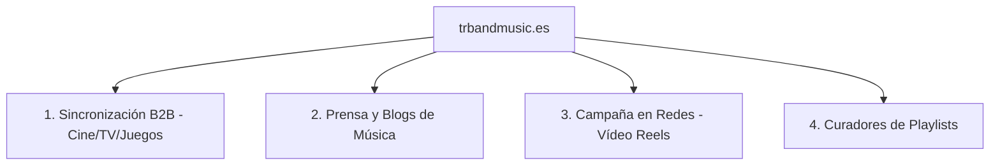

# 🚀 Plan de Promoción Agresiva — trbandmusic.es

Para promocionar "a lo bestia" la nueva web de **trbandmusic.es** y rentabilizar todo el repertorio de **The Research Band** (incluyendo el lanzamiento de *Cut the Roll & JazzRock* y el single *Wild and Free*), debemos activar una estrategia multinivel. 

No nos limitamos a "subir música a Spotify"; atacamos los canales profesionales de colocación y visibilidad de alto nivel.

---

## 🗺️ 1. Los 4 Pilares de la Campaña

---

## 🎯 Pilar 1: Sincronización B2B (Licenciamiento Cine, TV y Videojuegos)
El verdadero retorno económico en música instrumental está aquí. Colocar un tema en una serie de Netflix, un anuncio o un videojuego de renombre.

### Acciones:
1. **El "Frente Francotirador":** Utilizar la pestaña **"Uso Indirecto"** de tu panel de envíos [francotirador_emails.html](file:///c:/Users/Usuario/.gemini/antigravity-ide/scratch/francotirador_emails.html) para contactar con:
   * **Supervisores de música** en productoras de series/cine.
   * **Agencias de Sincronización** (Musicbed, Artlist, Marmoset, Epidemic Sound, etc.).
   * **Estudios de desarrollo de videojuegos indie** (que buscan Jazz-Rock sofisticado o Synth-Rock).
2. **El Gancho Técnico (100% One-Stop):** En cada email, destacar siempre que eres el dueño del **100% de la grabación (Master) y la edición (Publishing)**. Los supervisores odian el papeleo; si les dices que se puede licenciar en 5 minutos sin intermediarios, tu música pasa al primer puesto de su lista.

---

## 📰 Pilar 2: Prensa Especializada e Influencers del Sector
Hacer ruido en medios para ganar autoridad (social proof).

### Acciones:
1. **Lanzamiento de Nota de Prensa:** Redactar un comunicado centrado en el contraste y la historia: *"El regreso de The Research Band: fusión analógica de los 80, sintetizadores retro y la sofisticación del Jazz-Rock instrumental."*
2. **Plataformas de Envío Masivo:**
   * **SubmitHub / Groover:** Son plataformas baratas y muy eficaces. Por unos pocos euros, te garantizas que editores de blogs de jazz, rock y electrónica escuchen tu tema y te den feedback o lo publiquen en sus webs/playlists.
   * **Blogs Objetivo en España:** Escribir directamente a *Muzikalia*, *Jenesaispop*, *Mondo Sonoro* o *Binaural*.

---

## 📱 Pilar 3: Asalto en Redes Visuales (Instagram, TikTok, YouTube Shorts)
La música entra por los ojos. Necesitamos micro-contenidos en vídeo con gancho visual.

### Acciones:
1. **El Vídeo del "Detrás de las Cámaras" (Behind the Music):**
   * Grabar pequeños vídeos (o usar los que tengas de las sesiones de grabación) mostrando el proceso de mezcla, las pistas en el DAW o el diseño de sintetizadores.
   * **La Historia Humana:** Cuenta en 30 segundos cómo compusiste un tema o cómo es tu proceso creativo. La gente conecta con el creador, no con la canción vacía.
2. **Uso de Loops Visuales Abstractos (Visualizers):**
   * Crear animaciones cortas en bucle con portadas del disco (como la carátula de *Cut the Roll & JazzRock* o *Wild and Free*) para subirlas como reels usando la opción "Añadir audio" de tu propia música oficial.

---

## 🎧 Pilar 4: Conquista de Playlists (Spotify & Apple Music)
El algoritmo necesita señales para empezar a recomendarte.

### Acciones:
1. **Spotify for Artists:** Solicitar el "Pitch" del tema con **mínimo 3 semanas de antelación** al lanzamiento oficial de cada single. Esto garantiza entrar en el "Radar de Novedades" de todos tus seguidores.
2. **Caza de Curadores Independientes:**
   * Buscar en Spotify playlists de usuarios enfocadas en *"Jazz Fusion"*, *"Modern Jazz-Rock"*, *"Weather Report style"* o *"Chick Corea Tribute"*.
   * Localizar a los creadores de esas listas en Instagram y enviarles un mensaje corto y educado presentándoles el proyecto y el enlace a la web.

---

## 📅 Calendario de Trabajo Inmediato

- [ ] **Semana 1:** Preparar el listado de 20 contactos clave de supervisoras musicales en España y EE. UU.
- [ ] **Semana 2:** Diseñar 3 variantes de vídeos cortos (Stories/Reels) de 15 segundos con la carátula y el gancho de batería.
- [ ] **Semana 3:** Lanzar la primera ronda de emails a través de `francotirador_emails.html`.
- [ ] **Semana 4:** Subir la pista a Groover/SubmitHub coincidiendo con la fecha del lanzamiento digital.
